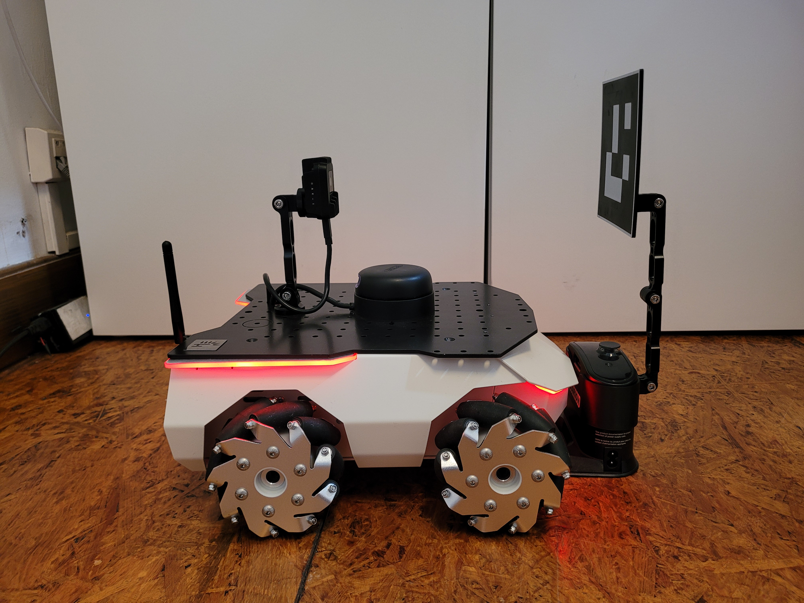

# rosbot-xl-docking

Reference project with ROSbot XL docking to the charging station with Nav2



## 🛍️ Necessary Hardware

For the execution of this project you need to have **[ROSbot XL](https://husarion.com/manuals/rosbot-xl/)** in the **Autonomy Package**.
It is available for purchase as a complete set at [our online store](https://store.husarion.com/collections/robots/products/rosbot-xl).

## Quick start

> [!NOTE]
> To simplify the execution of this project, we are utilizing [just](https://github.com/casey/just).
>
> Install it with:
>
> ```bash
> curl --proto '=https' --tlsv1.2 -sSf https://just.systems/install.sh | sudo bash -s -- --to /usr/bin
> ```

To see all available commands, run `just`:

```bash
husarion@rosbotxl:~/rosbot-xl-docking$ just
Available recipes:
    connect-husarnet joincode hostname # [PC] connect to Husarnet VPN network
    sync hostname="${SYNC_HOSTNAME}" password="husarion" # [PC] Copy repo content to remote host with 'rsync' and watch for changes
    flash-firmware # [ROSbot] flash the proper firmware for STM32 microcontroller in ROSbot XL
    oak-udev       # [ROSbot] setup udevs for managing Movidius USB device permissions
    start-rosbot   # [ROSbot] start containers on a physical ROSbot XL
    start-pc       # [PC] start RViz
    dds-tunning    # [PC/ROSbot] optimize DDS settings; Use if you experience stability issues.
```

### 🌎 Step 1: Connecting ROSbot and Laptop over VPN

Ensure that both ROSbot XL and your laptop are linked to the same Husarnet VPN network. If they are not follow these steps:

1. Setup a free account at [app.husarnet.com](https://app.husarnet.com/), create a new Husarnet network, click the **[Add element]** button and copy the code from the **Join Code** tab.
2. Run in the linux terminal on your PC:
   ```bash
   cd rosbot-xl-docking/ # remember to run all "just" commands in the repo root folder
   export JOINCODE=<PASTE_YOUR_JOIN_CODE_HERE>
   just connect-husarnet $JOINCODE my-laptop
   ```
3. Run in the linux terminal of your ROSbot:
   ```bash
   export JOINCODE=<PASTE_YOUR_JOIN_CODE_HERE>
   sudo husarnet join $JOINCODE rosbotxl
   ```
> [!IMPORTANT]
> note that `rosbotxl` is a default ROSbot hostname used in this project for syncing code. If you want to change it, edit the `.env` file and change the line:
> ```bash
> SYNC_HOSTNAME=rosbotxl
> ```

### 📡 Step 2: Sync

Copy the local changes (on PC) to the remote ROSbot

```bash
just sync rosbotxl # If name is not provided, the script will use SYNC_HOSTNAME from previous step.
```

> [!NOTE]
> This `just sync` script locks the terminal and synchronizes online all changes made locally on the robot. `rosbotxl` is the name of device set in Husarnet.

### 🔧 Step 3: Verifying User Configuration

To ensure proper user configuration, review the content of the `.env` file and select the appropriate configuration (the default options should be suitable).

- **`LIDAR_BAUDRATE`** - depends on the LiDAR model currently mounted
- **`MECANUM`** - wheel type
- **`SYNC_HOSTNAME`** - type your ROSbot device name the same as in Husarnet

> [!IMPORTANT]
> The value of the `SYNC_HOSTNAME` parameter in the `.env` file should be the same as the Husarnet hostname for ROSbot XL.

### 🤖 Step 4: Running Docker Setup

#### ROSbot

1. Connect to the ROSbot.

   ```bash
   ssh husarion@rosbotxl
   cd rosbot-xl-docking
   ```

   > [!NOTE]
   > `rosbotxl` is the name of device set in Husarnet.

2. Flashing the ROSbot's Firmware.

   To flash the Micro-ROS based firmware for STM32F4 microcontroller responsible for low-level functionalities of ROSbot XL, execute in the ROSbot's shell:

   ```bash
   just flash-firmware
   ```

3. Setting OAK-1 camera udevs.

    To make your camera work with ROS, you have to setup permissions for its USB device:

    ```bash
    just oak-udev
    ```

3. Running autonomy on ROSbot.

   ```bash
   just start-rosbot
   ```

#### PC

To show the RViz user interface, execute below command on your PC:

```bash
just start-pc
```

### 🚗 Step 5: Docking using ROS 2 actions

The default docking configuration assumes that your ROSbot is turned on while it's docked.
Place the robot in the charging position and then restart the stack using `just start-rosbot`.

To initiate the undocking sequence, attach a terminal to the docking container on your ROSbot (which has ROS 2 with the `opennav_docking` package) ...and use the `DockRobot` action:
```sh
docker exec -it rosbot-xl-docking-docking-1 bash
ros2 action send_goal /undock_robot opennav_docking_msgs/action/UndockRobot "{dock_type: simple_charging_dock}"
```

The robot will drive backwards half a meter away from the docking station.

Then you can use the "2D Goal Pose" tool in RViz to make the ROSbot navigate to any location on the map.

ROSbot can autonomously return to the station and attach back to it from any location in the room:
```sh
ros2 action send_goal /dock_robot opennav_docking_msgs/action/DockRobot "{dock_id: home_dock}"
```
